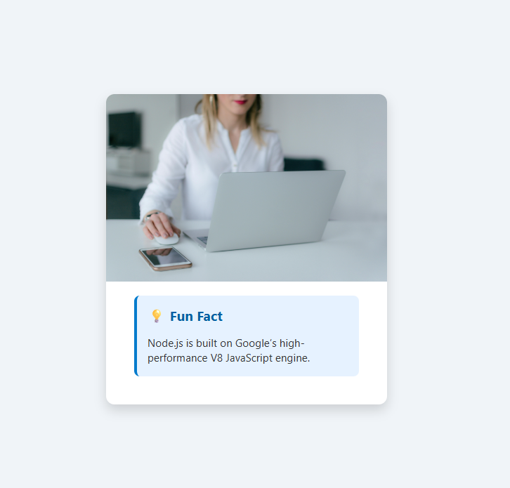

# IBM_nodejs_project01

IBM MicroBachelors Full Stack Application Development => NodeJS Project

# IBM Node.js Project – Full Stack Web Development

This repository contains the project work completed as part of the guided course:

📚 **[IBM – Build a Full Stack Application with Node.js](https://learning.edx.org/course/course-v1:IBM+GPXX0KJJENV2+1T2024/block-v1:IBM+GPXX0KJJENV2+1T2024+type@sequential+block@cf9fb501ac4348b29fbc2dadd2503441/block-v1:IBM+GPXX0KJJENV2+1T2024+type@vertical+block@ef34ad5a7790471496ad15181ae62a25)**
_(Hosted on edX)_

---

## 🚀 About the Course

> **Node.js** is the environment of choice for many industries, including IT and healthcare, and is used by developers to build fast, scalable network applications.
>
> If you know JavaScript, you can build both **front-end** and **back-end** applications using Node.js.
>
> In this hands-on guided project, you will learn how to:
>
> - Develop both front end and back end with JavaScript
> - Style the front end using HTML and CSS
> - Use **npm**, the JavaScript package manager
>
> 💡 By the end of this guided project, you will have a **foundation for full-stack application development**.

---

## 🧰 What You'll Learn

- ✅ Run a simple Node.js app on your localhost
- ✅ Use **npm** to install and manage packages
- ✅ Add styling to your app using **HTML** and **CSS**
- ✅ Build both **frontend** and **backend** using JavaScript
- ✅ Understand the basics of full-stack development with Node.js

---

## 🖥️ Development Environment

The course provides access to a **Cloud-based IDE** that includes:

- Node.js (pre-installed)
- npm
- HTML, CSS and JavaScript tools

Alternatively, you can clone this repo and run it locally on your machine using Node.js.

---

## 💻 Project Preview

Here is a screenshot of the application:


---

## 📁 Project Structure

> 🟦 The HTML page is served from the `public/` folder.  
> 🖼️ The project screenshot is stored in `assets/`.  
> 🔧 Main backend logic is in `server.js`.

IBM_nodejs_project01/
├── assets/
│ └── IBM_nodejs_project01.png # Project screenshot
├── node_modules/ # Installed npm packages
├── public/
│ ├── helloword.html # Frontend HTML file
│ └── style.css # Styling for the project
├── script.js # Frontend logic (fetches API)
├── server.js # Node.js + Express backend
├── package.json # Project metadata and dependencies
├── package-lock.json # Exact versions of installed packages
└── README.md # Project documentation

---

## ⚙️ Getting Started

To run the project locally:

```bash
npm install
node index.js
Then open your browser and go to:
http://localhost:3000
(or the port defined in your app)

📜 License
This project is part of an educational course and is intended for learning purposes only.

🙋‍♀️ Author
Created by Monika Sulecka-Grochowska as part of the IBM Full Stack Developer program.
```
